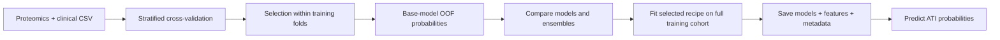

# MedAI — Acute Tubular Injury Prediction

A MedAI Hackathon Challenge 3 project exploring how plasma proteomics and clinical
covariates can predict **acute tubular injury (ATI)** in the Boston Kidney Biopsy
Cohort. The project compares gradient boosting, regularized linear models,
supervised dimensionality reduction, TabPFN, and probability ensembles through
reproducible evaluation, training, and inference workflows.

The central challenge is learning from **426 samples and 6,592 protein features**:
there are far more measurements than patients. The work focuses on feature
selection, validation discipline, and reliable probabilities.

## Problem and data

Each row represents a sample with an ATI label (`0`: absent, `1`: present).
The local snapshot contains 200 positive and 226 negative examples.

| Columns | Purpose |
| --- | --- |
| `sample_id` | Sample identifier, excluded from model features |
| `ati` | Binary target; optional during inference |
| `feature_XXXX` | 6,592 anonymized SomaScan protein abundance measurements |
| `age`, `sex`, `baseline_egfr_23` | Clinical covariates |

**Log loss** is the primary selection metric; **AUROC** measures ranking
performance. Clinical-only, eGFR-only, and no-eGFR ablations assess reliance on
clinical proxies. Scripts default to `data/train.csv` and accept `--data` paths.
Use cohort data according to its access conditions. The local snapshot is smaller
than the planned cohort sizes in the original research notes.

## Modeling approaches

The three workspaces preserve distinct hackathon experiments and artifact
formats. They remain separate so historical models can still be loaded.

| Track | Approaches | Engineering focus |
| --- | --- | --- |
| [`kidney/`](kidney/README.md) | XGBoost, optional LightGBM, elastic-net logistic regression; convex blending, ridge stacking, sigmoid-calibrated stacking | Repeated stratified CV, seed averaging, clinical ablations, top-k and stability selection |
| [`Nav/`](Nav/README.md) | Starter and selected-feature XGBoost, ridge logistic regression, shrinkage LDA, PLS + logistic regression; fixed and learned blends | Complementary model families and compact protein panels |
| [`Felix/kidney/`](Felix/kidney/README.md) | TabPFN v2 with top-k proteins and clinical covariates | Pretrained tabular classification after reducing the feature space |

Protein ranking is fitted on each training fold. Linear pipelines fit imputation
and scaling on training data. Out-of-fold (OOF) probabilities support ensemble
comparison, and saved feature lists keep inference aligned with training.



## Recorded results

These values are arithmetic means across the five folds in the saved
[Nav experiment](Nav/results/selected_models/cv_results.csv). They describe a
historical local run, not an external test or leaderboard result.

| Model | Mean fold log loss ↓ | Mean fold AUROC ↑ |
| --- | ---: | ---: |
| Starter XGBoost, all features | 0.6259 | 0.7521 |
| XGBoost, top 90 proteins + clinical | 0.5603 | 0.7812 |
| Ridge logistic regression, top 80 proteins + clinical | 0.5698 | 0.7662 |
| XGBoost + ridge + PLS probability blend | **0.5470** | **0.7960** |

The saved blend uses weights of 0.45 / 0.40 / 0.15. These results motivated
further experiments with repeated CV and learned ensemble recipes. TabPFN and
LightGBM implementations are preserved, but no comparable saved fold results
are claimed for them here.

Feature selection and ensemble recipes were explored using local CV, so scores
can be optimistic after repeated experimentation. Tree early stopping also uses
the validation fold, and second-stage cross-fitting of OOF predictions is not
a fully nested evaluation of the complete ensemble search. An untouched external
cohort is needed to assess generalization. This is a hackathon research prototype
with no clinical deployment validation.

## Run locally

Use **Python 3.12**. Dependency files pin direct scientific-computing dependencies
from the project environment and exclude unrelated notebook/server packages.

```bash
python3.12 -m venv .venv
source .venv/bin/activate
python -m pip install -r requirements.txt
```

On macOS, XGBoost and LightGBM need the OpenMP runtime (`brew install libomp`
if it is missing). Keep the same dependency versions when loading older joblib
artifacts; regenerate weights if the model environment changes.

From the repository root:

```bash
# Omit --models to run the full default model ladder.
python kidney/evaluate.py --data data/train.csv --out kidney/results \
  --models xgb_fs1 xgb_fs2 elastic_fs2 clinical_lr egfr_only_lr clinical_no_egfr_lr
python kidney/train.py --data data/train.csv \
  --results-dir kidney/results --out kidney/weights
python kidney/predict.py --data /path/to/new_samples.csv \
  --model-dir kidney/weights --out predictions.csv
```

Evaluation defaults to five folds and three repeats. For a shorter run, pass
`--folds 3 --repeats 1`. Parallel evaluation supports `--workers`; limit inner
threads with `--xgb-n-jobs 1 --elastic-n-jobs 1`. Training consumes the recipe
and OOF matrix from evaluation; use outputs from the same training dataset.

Optional approaches:

```bash
# LightGBM
python -m pip install -r requirements/lightgbm.txt
python kidney/evaluate.py --data data/train.csv --out kidney/results_lgbm \
  --models xgb_fs2 lgbm_fs2 elastic_fs2

# Nav: selected boosting, linear, LDA, and PLS models
python Nav/evaluate.py --data data/train.csv --out Nav/results/current
python Nav/train.py --data data/train.csv \
  --recipe Nav/results/current/final_recipe.json --out Nav/weights
python Nav/predict.py --data /path/to/new_samples.csv --out predictions_nav.csv

# TabPFN; install in a separate environment if preferred
python -m pip install -r Felix/kidney/requirements.txt
python Felix/kidney/evaluate.py --data data/train.csv --protein-top-k 100
python Felix/kidney/train.py --data data/train.csv --protein-top-k 100
python Felix/kidney/predict.py --data /path/to/new_samples.csv --out predictions_tabpfn.csv
```

TabPFN uses its local Python classifier. The first model run may download a
checkpoint and needs network access unless it is cached. Device and ensemble
settings are exposed through CLI flags. See each track's README and `--help`
for the full options.

Each `predict.sh` uses the active Python environment. `MEDAI_PYTHON` can supply
an explicit interpreter for evaluation runners:

```bash
MEDAI_PYTHON="$PWD/.venv/bin/python" bash kidney/predict.sh \
  /path/to/new_samples.csv predictions.csv --model-dir kidney/weights
```

Prediction CSVs contain `sample_id`, `prob_ati`, and `pred_label`; labeled inputs
also include `true_label`. The default threshold is 0.5. Missing feature columns
are reported and aligned as NaN; provide the full saved feature schema for
meaningful predictions. Metrics on training data describe fit, not unseen performance.

## Repository guide

```text
MedAI/
├── kidney/              # Main ensemble and ablation pipeline
├── Nav/                 # Boosting, linear, LDA, and PLS experiments
├── Felix/kidney/        # TabPFN pipeline
├── data/                # Local training snapshot
├── research/            # Challenge materials and modeling research
├── requirements/        # Shared, optional, and development dependencies
├── tests/               # Regression and synthetic pipeline checks
├── requirements.txt     # Core environment
└── pyproject.toml       # Lint and formatting configuration
```

Each track contains `evaluate.py`, `train.py`, `predict.py`, `model.py`, and
`preprocess.py`. Evaluation writes metrics and recipes under `results/`; training
writes artifacts under `weights/`. Research notes and result tables retain the
experimental progression. New smoke-run directories, serialized joblib weights,
local data files, and predictions are ignored by Git; already tracked files
remain tracked.

## Skills demonstrated

- **High-dimensional ML:** tree, linear, latent-factor, and pretrained tabular
  approaches under a small-sample constraint.
- **Experimental design:** fold-local selection, stratified and repeated
  validation, seed averaging, and clinical-feature ablations.
- **Probability modeling:** log-loss optimization, convex blends, OOF stacking,
  and calibration experiments.
- **ML engineering:** reusable builders, portable CLIs, saved feature schemas,
  artifact metadata, and separate evaluation/training/inference stages.
- **Research judgment:** retaining unsuccessful approaches and documenting the
  limits of local validation.

## Development checks

```bash
python -m pip install -r requirements/dev.txt
python -m ruff check .
python -m ruff format --check .
python -m unittest discover -s tests -v
```

Tests use synthetic data and temporary outputs without replacing saved models
or downloading TabPFN checkpoints. No `.env` file is required: configuration
comes from CLI arguments, and the pipelines do not consume API credentials.
Local `.env` files are ignored if a future integration needs them.
